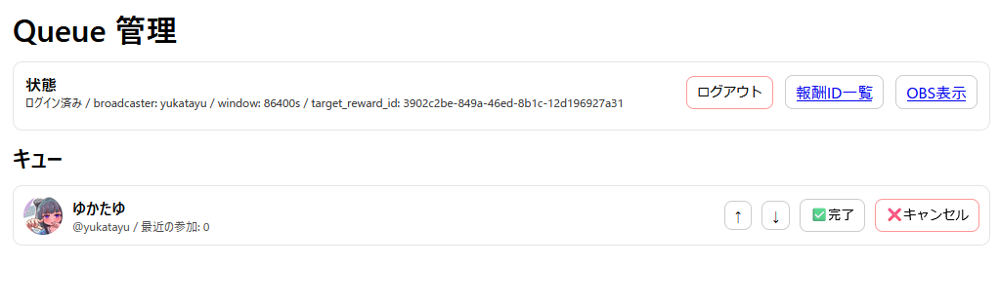
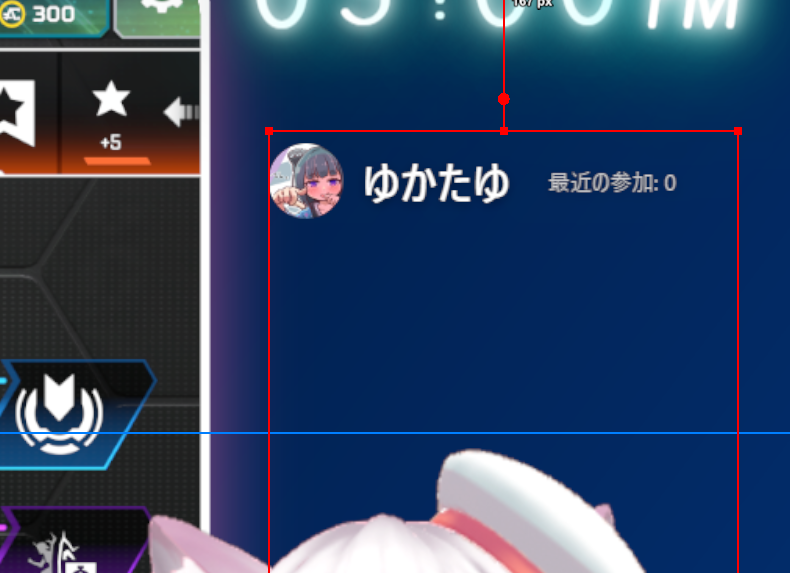

# twitch_obs_queue

## これは何？
- Twitchで特定のチャンネルポイントを交換した人を，OBSに一覧表示します
- 最近参加した回数が少ない人を先頭に持っていく機能があります
- キャンセル用のチャンネルポイントで参加をキャンセルできます

> ▼ 管理画面の例
> 

> ▼ OBS画面の例
> 

## 初期設定は？

Windows 前提で話します。 （Linux の場合には適宜ファイル名を読み替えてください。）

- https://github.com/yukatayu/twitch_obs_queue/releases から最新版の  `twitch_obs_queue-x86_64-pc-windows-msvc.zip` をダウンロードし，展開します。

- config.example.toml を config.toml にコピーする
- twitch 側にアプリを登録する
  - https://dev.twitch.tv/console/apps/create に行く
  - (名前は何でも良いです)
  - OAuthのリダイレクトURL は `http://localhost:3000/auth/callback`
  - カテゴリは `Application Integration` (別のでも良い)
  - クライアントのタイプは `機密保持について` を選択
  - `作成` を押す
  - 自動で https://dev.twitch.tv/console/apps が開かれるので，今登録した行の右側の `管理` を押す
  - `クライアントID` に書いてある記号列で， config.toml の `YOUR_TWITCH_CLIENT_ID` を置換する
  - `新しい秘密` を押す
  - 出てきた記号列で， config.toml の `YOUR_TWITCH_CLIENT_SECRET` を置換する。

config.toml の該当部は，例えばこんな感じになります (記号列は人によって異なります)
```yaml
[twitch]
client_id = "4kasdo4ijadtas89jasolidgjbmeio"
client_secret = "3u3dsiaukh3agha8g97ah3kjh9akeh"
```

- twitch_obs_queue.exe を実行する
  - http://localhost:3000/ をブラウザで開くと管理画面が出る
  - `未ログイン` と出るので，まずは `Twitchでログイン` を押してログインする
  - `config.toml の twitch.target_reward_ids が未設定です。` と出るので，設定する
    - `報酬ID一覧` を押して表示する
    - 参加券として使うIDを1つ以上控える
    - config.toml の `target_reward_ids` に配列で設定する

config.toml の該当部は，例えばこんな感じになります（記号列は人によって異なります）
```yaml
target_reward_ids = ["3902c2be-849a-46ed-8b1c-12d196927a31"]
```
複数指定した場合には，例えばこうなります （もちろん3つ以上設定することも可能です）
```yaml
target_reward_ids = ["3902c2be-849a-46ed-8b1c-12d196927a31", "521be219-3e1f-4f78-898b-9a2885c4f73e"]
```

- `target_reward_ids = []` かつ `cancel_reward_id = ""` のままでもWeb画面は起動しますが，EventSubは無効です

- やってもやらなくても良い設定
  - 参加キャンセル用の券があるなら，それを `cancel_reward_id` に設定してください
  - 設定されていない場合も問題なく動作します。

- twitch_obs_queue.exe を閉じて開きなおす
- `OBS表示` のボタンを押します
  - http://localhost:3000/obs が新規タブで開く
  - このURLを OBS のブラウザソースに追加する (幅300程度)


## 操作方法

- 管理画面は http://localhost:3000/ で開ける。
- 人がチャンネルポイントを交換すると，管理画面に追加される。
  - 管理画面で「完了」か「キャンセル」を押すと，エントリーが消える
  - 24時間以内に「完了」した回数が少ない人が優先して列の先頭に入れられる
    - この設定を0秒 や 1秒 にすることで，実質無効にできる
    - config.toml の participation_window_secs で秒数を設定できる
  - 既に並んでいる人が再び参加券を引き換えても，何も起きない
    - 完了を押し忘れないようにしてあげてくださいね
    -  (ゲーム開始した時点で完了を押すと良いと思う)
  - 順番は ↑ ↓ ボタンを押すことで入れ替え可能です

## トラブルシューティング

- `unauthorized` / `failed to create subscription`
  - Twitch の OAuth スコープが足りない可能性
  - このアプリは `channel:read:redemptions` を要求します
- `redirect_uri does not match`
  - Twitch 開発者コンソールに登録した Redirect URL と config.toml が完全一致しているか確認してください
